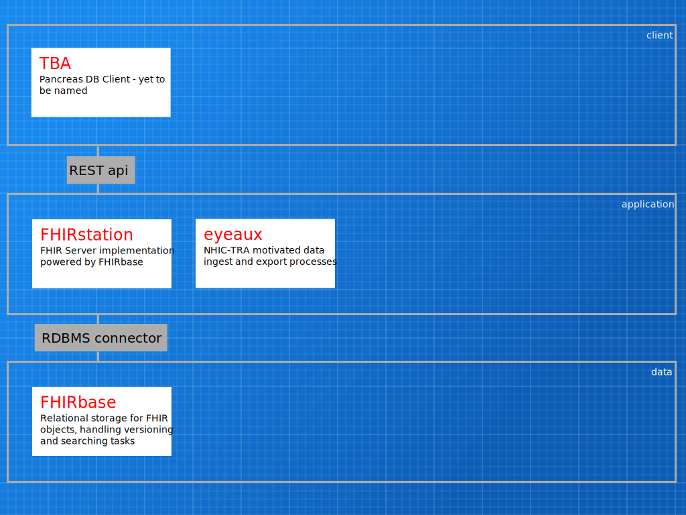

# Introduction
**Summary:** FHIR server django app built on top of [FHIRbase](http://fhirbase.github.io)

**Key objectives:**

* Provide a working, documented, FHIR API interface
* Meet the HL7 FHIR [Implementer's Safety Checklist](http://hl7.org/implement/standards/fhir/implementation.html#Use)
* Support server side django application development by providing the relevant FHIR objects as python/django classes
* Keep technology stack to the minimal technologies identified in Diakonia (python/postgres) to aide maintenance, development, and system administration
* Be as [pythonic](https://en.wikipedia.org/wiki/Zen_of_Python) as possible. [Zen is good](https://www.python.org/dev/peps/pep-0020/)

## Notes
Background research for alternative solutions:

* [FHIRbase Github Repository](https://github.com/fhirbase/fhirbase-plv8)
* [List of open source FHIR implementations](http://wiki.hl7.org/index.php?title=Open_Source_FHIR_implementations) contains 4 examples: One in [Delphi/MSSQL](https://github.com/grahamegrieve/fhirserver); One in Grails (Java/Groovy/Postgres); One in [.net/MongoDB](https://github.com/furore-fhir/spark); One in Java/java-db. None of these fit the technology stack requirements
* [GNU Health](https://en.wikibooks.org/wiki/GNU_Health) offers a FHIR server in [python/tryton/postgres](https://en.wikibooks.org/wiki/GNU_Health/Installation) stack, so may offer some help, but isn't close enough to the mark to start from
	* The Tryton based server code is at [http://hg.savannah.gnu.org/hgweb/health/file/9e52df027d5d/tryton/backend/fhir/server](). Not clear at first glance as to its operation and how/why the fhir classes are hardcoded
	* The basic [python client](https://pypi.python.org/pypi/fhir) from them is also not maintained... (last uploaded 17/4/2014)
* SMART on FHIR offers a maintained [python FHIR client](https://github.com/smart-on-fhir/client-py) with [good documentation](https://smart-on-fhir.github.io/client-py). This may be able to be incorportated to provide the FHIR objects as python classes, however this is written as a flask app, so can't be fully run without expanding the tech base with another python framework
	* Perhaps of more use is the SMART on FHIR, [fhir-parser](https://github.com/smart-on-fhir/fhir-parser) which goes through the specification and generates python classes
	* They also have a [package of sample patients](https://github.com/smart-on-fhir/sample-patients) for testing with
* [Django-FHIR](https://github.com/videntity/django-fhir) (nice optimistic title) is an alpha level project that hasn't seen development in 5+ months which aims to do python/django/mongodb implementation of a FHIR server. Alpha level is a bit of a stretch from browsing through the current master branch, looks like there isn't much to work from here

## Requirements

1. Provide a RESTful, FHIR-compliant, API to the data layer
	1. API should be available via https
	2. API should support REST methodology
	3. API should support the following FHIR calls: Create (http `POST`), Read (http `GET`), Update (http `PUT`), Delete (http `DELETE`)
	4. API should additionally support FHIR calls: vread, history (instance), search (instance), history (type), conformance, history (system), search (system). See [FHIR RESTful API](https://www.hl7.org/fhir/http.html) pages, in particular the [summary table](https://www.hl7.org/fhir/http.html#summary).

2. Create (a resource) should:
	1. Accept http POST request
	2. Map the contents to an url which indicates the resource type (E.g. `http://server.org/fhir/patient`)
	3. Accept the body’s format in Content-Type header (**a:** `application/json+fhir;charset=utf-8` and **b:** `application/xml+fhir;charset=utf-8`)
	4. Return http status 201 (Created).
	5. Return only the newly assigned version id URL in the Location header

3. Update (a resource) should:
	1. Accept http PUT request
	2. Map the contents to an url which indicates the resource type (E.g. `http://server.org/fhir/patient/id/_history/version_id`)
	3. Accept the body’s format in Content-Type header (**a:** `application/json+fhir;charset=utf-8` and **b:** `application/xml+fhir;charset=utf-8`)
	4. Return http status 200 (OK), and the full version URI
	5. If resource does not exist, return http status 405 (Method Not Allowed). This is update, not update-or-create!
	6. If the resource URI does not match the latest version, return http status 409 (Conflict) and do not apply the update
 

## Design
This is the nitty gritty bit... what **is** a FHIR Server? How much functionality can we hand off to FHIRbase? Are there packages (like [Django REST Framework](http://www.django-rest-framework.org)) we can hand off large chunks of functionality to? 

FHIRbase have [taken the view that](http://try-fhirplace.hospital-systems.com/fhirbase-presentation/index.html#/fhirbase) json is the standard for web apis, and so don't export xml natively. They do offer an xslt transformation for [FHIR xml to json](https://github.com/fhirbase/fhir-xml2json), which is handy, but nothing vice-versa. Whilst it recommends using Saxon as the XSLT engine, [lxml](http://lxml.de) is [a more common](http://stackoverflow.com/questions/16698935/how-to-transform-an-xml-file-using-xslt-in-python) python approach. There is a [JS implementation that does json to xml](https://github.com/kwboone/FHIR-JSON-to-XML-Converter) to look at. **Consider:** Leaving XML implementation to a later version of FHIRstation.

System layer diagram (modelled on the [Hospital Systems](http://try-fhirplace.hospital-systems.com/fhirbase-presentation/index.html#/) one). Work in Progress, clearly.

We're using FHIR as a semantic structure for the data layer, with FHIR-like communication happening between data and application layers. FHIR (exact) communication should then be happening between the client and application layers. 

Standard ORM techniques from most frameworks are of limited use with FHIRbase directly, though given other system elements will reside in a Postgres DB, they will still have their uses, and the FHIRbase DB can also be queried by `SQL SELECT` statements via ORM.

**Question:** Do we handle the Binary endpoint? [https://www.hl7.org/fhir/binary.html](https://www.hl7.org/fhir/binary.html) There's no hint in the FHIRbase docs about what it does or does not support regarding binary types.